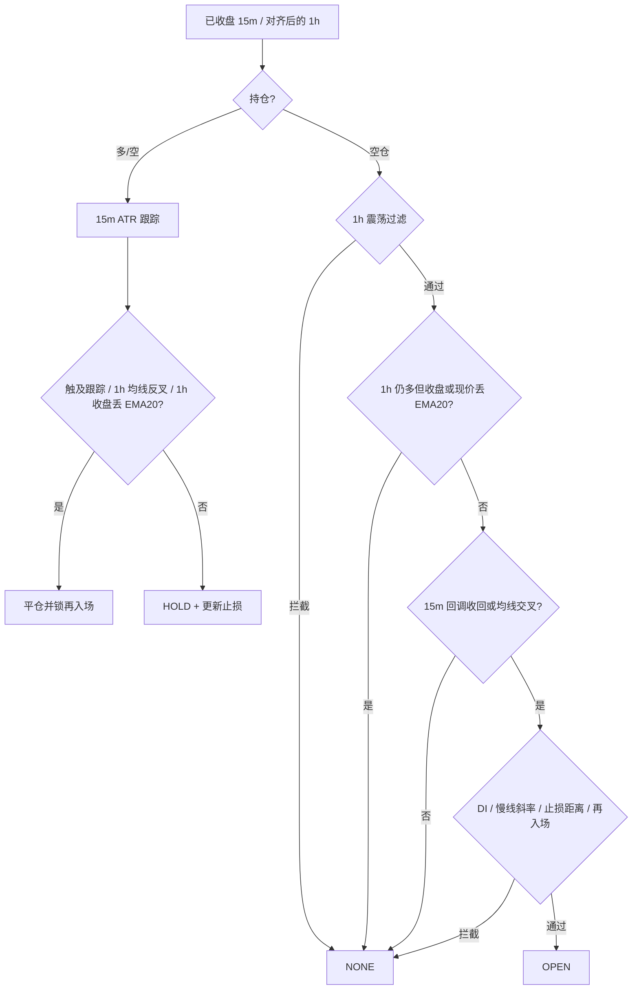

# 策略说明

本文档对应 `backend/internal/strategy` 的实现，以及 `backend/configs/config.yaml` 中当前随仓库发布的参数。引擎每轮把持仓同步进策略，策略只在**已收盘 K 线**上给出一条信号，不重绘。

当前运行：`strategy.name: trend`，标的 ETHUSDT 永续。

| 名称 | 配置值 | 实现 | 用途 |
|------|--------|------|------|
| 趋势回调 | `trend` / `trend_follow` | `TrendFollow` | 1h 定方向，15m 回调进场，ATR 跟踪止损 |
| 压缩突破 | `squeeze` / `squeeze_breakout` | `SqueezeBreakout` | 主周期 Donchian 突破，只在波动压缩后开仓 |

共用：`atr_period: 14`，`min_bars: 220`（squeeze 还会按指标预热再抬高下限）。

---

## 引擎怎么用策略

策略接口只有三件事：`Name`、`Sync(持仓)`、`Evaluate(主周期K线, 市场上下文)`。

信号动作：

- `NONE`：观望或持仓（持仓时 `StopLoss` 仍是当前跟踪止损，引擎会去对齐交易所条件单）
- `OPEN_LONG` / `OPEN_SHORT`：开仓，必须带止损
- `CLOSE_LONG` / `CLOSE_SHORT`：全部平掉
- `REDUCE_LONG` / `REDUCE_SHORT`：按 `Portion` 减仓（仅 squeeze 的 TP1）

规则：

1. 最后一根未收盘 K 线会被丢掉，信号只看已收盘 bar。
2. 趋势策略若配置了与主周期不同的 `timeframes.entry`（默认 15m），引擎会把这组 K 线放进 `MarketContext.Entry`。squeeze **不用**入场周期。
3. 持仓状态每轮从纸面账户或币安仓位推入策略；重启后靠 Redis 快照恢复跟踪止损和再入场锁。
4. 策略本身不算仓位数量。数量由风控按「单笔风险 / 止损距离」计算，再受名义价值上限约束。

---

## 趋势策略（TrendFollow）

文件：`backend/internal/strategy/trend.go`。

思路：在已经确认的趋势里，等价格回到快线附近再进，而不是追突破。ADX 只衡量趋势强度、不区分多空，所以方向必须另用均线和 DI 确认。

### 周期分工

| 周期 | 配置 | 职责 |
|------|------|------|
| 主周期 | `timeframes.primary: 1h` | EMA20/60/200、ADX/DMI、均线间距与斜率、趋势翻转离场、1h 收盘丢 EMA20 离场 |
| 入场周期 | `timeframes.entry: 15m` | 回调触及 / 金叉死叉、距 EMA20 的追价限制、初始止损与 ATR 跟踪 |

未配置入场周期（或与主周期相同）时，上述全部落在主周期上。单周期下，新鲜 EMA 交叉还要求 ADX ≥ `adx_min + cross_adx_bonus`（默认 27）；多周期时主周期已经过震荡门，交叉不再额外加 ADX。

### 多空判定（1h）

- 多头：EMA20 > EMA60；若 `use_ema200_filter`，还要 1h 收盘与现价都在 EMA200 上方。
- 空头：对称。
- 仅均线金叉、价格已跌破 EMA200 时，**不会**当多头。

### 开仓

必须先通过 1h 震荡过滤，再出现 15m 形态之一：

**震荡过滤（`chopBlock`，做在 1h 上）**

| 条件 | 默认 | 拒绝原因（多周期带 `1h ` 前缀） |
|------|------|--------------------------------|
| ADX < `adx_min` | 22 | `ADX … chop` |
| ADX 不高于 `adx_rising_bars` 根之前 | 2 | `ADX falling … chop` |
| \|EMA20−EMA60\| < `ema_sep_min_atr` × 1h ATR | 1.0 | `EMA tangled …` |

均线刚粘上的弱反抽（间距不足 1 倍 1h ATR）在这里被挡掉。

**方向过滤（`directionBlock`）**

- `use_di_filter`：多头要求 +DI > −DI，空头相反。
- 慢线斜率：EMA60 在 `ema_slope_bars`（5）根内的变化，多头至少 `+0.08` × 1h ATR，空头至少同样幅度向下。走平不开。

**方向失效（`require_ema20_side`，默认开）**

EMA20/60 还没交叉时，1h 看起来仍是多头，但新下跌已经开始。此时：

- 开新多：1h **收盘**或**现价**（15m 收盘）任一 ≤ 1h EMA20 → 拒绝（`close lost 1h EMA20` / `price below 1h EMA20`）。
- 开新空：对称。
- 持仓离场：只用 1h **收盘**相对 EMA20，15m 刺破不算，避免被噪声洗出。

**15m 形态（必须处于对应 1h 趋势中）**

1. **回调续势（主路径）**  
   多头：15m EMA20 > EMA60；上一根最低价仍在 EMA20 上方；本根最低价触及或跌破 EMA20；本根收盘重新站上 EMA20。  
   空头对称（最高价触及后收盘跌回均线下方）。  
   「上一根必须离开均线」避免止损后价格贴着均线反复开仓。
2. **EMA 交叉**：15m EMA20 上穿/下穿 EMA60，且 1h 方向一致。

**其它拒绝**

- 现价距 15m EMA20 > `chase_max_atr` × 15m ATR（默认 1.5）→ `too far from EMA20, no chase`。
- 止损距离 < `min_stop_atr` × **1h ATR**（默认 1.0）→ `stop too tight`。15m 止损过近会把仓位放大，且扛不住 1h 噪声；这里是拒绝，不是把止损放宽（放宽后 15m 跟踪仍会立刻收紧）。
- 再入场锁未解除（见下文）。



### 止损与持仓

初始止损（多）：`min(现价 − atr_stop_mult × 15m ATR, 近 10 根 15m 摆动低点)`。空头用摆动高点，取更远的那一侧。`atr_stop_mult` 默认 1.5。

持仓后只向有利方向收紧：

- 跟踪：`atr_trail_mult` × 15m ATR（默认 1.0）。实盘由引擎把该价挂成 STOP_MARKET，只收紧不放宽。
- 1h EMA20/60 反叉：`ema cross down` / `ema cross up`。
- 1h 收盘失去 EMA20（多）或重新站上（空）。

策略给出 `CLOSE_*` 时引擎市价平仓；交易所条件单先成交时，引擎按仓位消失记账，并在后续从币安成交同步真实 `realizedPnl`。

### 再入场锁

止损或平仓后，同一方向不能立刻在同一价位再进。锁存在 Redis，重启仍有效。

解锁要同时满足（默认）：

1. `require_reset`：15m 出现一根完全离开 EMA20 的 K 线（多：最低价 > EMA20）。
2. `reentry_htf_reset`：1h 收盘重新站上（多）或跌破（空）EMA20。仅 15m 反弹不够，否则下跌中一次反抽就会把锁打开。
3. `reentry_cooldown`：离场后再等 4 根 **15m** K 线。
4. `reentry_atr`：现价与上次开仓价（或当时 EMA20）距离 ≥ 0.25 × 15m ATR。

### 趋势参数（当前配置）

| 键 | 值 | 作用 |
|----|----|------|
| `ema_fast` / `ema_slow` / `ema_filter` | 20 / 60 / 200 | 趋势栈与 EMA200 过滤 |
| `adx_period` / `adx_min` | 14 / 22 | 强度下限 |
| `adx_rising_bars` | 2 | ADX 仍在抬升 |
| `ema_sep_min_atr` | 1.0 | 均线间距，挡弱反抽 |
| `ema_slope_bars` / `ema_slope_min_atr` | 5 / 0.08 | 慢线不能走平 |
| `use_di_filter` | true | +DI / −DI 与方向一致 |
| `cross_adx_bonus` | 5 | 仅单周期交叉 |
| `atr_stop_mult` / `atr_trail_mult` | 1.5 / 1.0 | 初始止损与跟踪 |
| `chase_max_atr` | 1.5 | 禁止远离 EMA20 追价 |
| `min_stop_atr` | 1.0 | 止损至少 1×1h ATR |
| `use_ema200_filter` | true | 价格与 1h 收盘相对 EMA200 |
| `require_ema20_side` | true | 丢失快线则方向失效 |
| `reentry_*` / `require_reset` / `reentry_htf_reset` | 见上 | 止损后再入场 |

`require_reset`、`reentry_htf_reset`、`require_ema20_side` 省略时默认开启；要关掉必须在 yaml 里写成 `false`。震荡类数值门（ADX 抬升、均线间距、斜率、`min_stop_atr`）为 `0` 表示关闭。

---

## 压缩突破（SqueezeBreakout）

文件：`backend/internal/strategy/squeeze.go`。只使用主周期（默认 1h）。

思路：安静区间会在通道外堆积止损，价格打掉后容易走出扩张段。先要求波动处于压缩分位，再做通道穿越；资金费率过高说明该方向已经拥挤，当作假突破过滤。

### 开仓

按顺序：

1. **压缩**：突破 **前一根** 的 ATR%（ATR/收盘）在过去 `atr_lookback`（100）根里的分位 ≤ `atr_pct_max`（0.2）。把突破当根算进去会因为真波幅变大而自我否决。
2. **新鲜穿越**：收盘站上 Donchian 上轨（多）或跌破下轨（空），且 **上一根收盘** 仍在通道内或刚好在沿上。停在通道外不重复触发。
3. **趋势**：`use_trend_filter` 时，多头价格须在 EMA200 上方（空头下方）。
4. **不追**：突破点距通道沿 ≤ `breakout_max_atr` × ATR（1.0）。
5. **资金费率**：`use_funding_filter` 时，多头 funding > `funding_abs_max`（0.05%/8h）拒绝；空头 funding 过负同样拒绝。
6. **再入场锁**。

初始止损：`atr_stop_mult` × ATR（1.2），该距离定义为 1R。

### 持仓

与趋势策略不同，突破仓位管理是不对称的：小胜先兑现一部分，剩余用吊灯跑，走平则砍。

| 动作 | 条件 | 默认 |
|------|------|------|
| 吊灯跟踪 | 多：回看高点 − `chandelier_mult` × ATR；只收紧 | period 22，mult 3.0 |
| 结构失败 | 收盘回到 Donchian 中轨内侧 | — |
| 时间止损 | 持仓 ≥ `time_stop_bars` 且进展 < `time_stop_min_r` | 12 根 / 0.5R |
| TP1 减仓 | 进展 ≥ `tp1_r` 且尚未减过 | 1.0R，平掉 50% |
| 保本 | `breakeven_after_tp1`：减仓后止损不低于成本 | true |

进展 R = 浮动盈亏 / \|开仓价 − 开仓止损\|。没有历史止损时（例如接管旧仓）用当前 `atr_stop_mult × ATR` 代替。

### 再入场

- 复位：价格重新回到通道内（`require_reset`）。
- 冷却：2 根主周期。
- 同水平：现价或通道沿距上次开仓 < 0.25 × ATR。

`use_trend_filter` / `use_funding_filter` 省略时默认开启。

---

## 共用：再入场锁

文件：`backend/internal/strategy/reentry.go`。

仓位从有到无时上锁（策略平仓或交易所止损都算）。同方向新开仓在复位、冷却、离旧价足够远之前会被拒绝。对侧开仓不受影响。

锁字段随 Redis 持久化：`Armed`、方向、入场价、结构边（EMA20 或通道沿）、上锁 bar 时间、是否已复位。

---

## 仓位与风控（策略之外，但决定成交）

文件：`backend/internal/risk/manager.go`。

开仓数量：

```
qty = (权益 × risk_per_trade) / |入场价 − 止损|
qty = min(qty, 权益 × 杠杆 × max_notional_pct / 价格)
```

当前：单笔风险 0.75% 权益，名义价值不超过权益×杠杆的 70%。止损越近单子越大，因此趋势策略用 `min_stop_atr` 先拒绝过近止损，而不是只靠名义上限硬切。

熔断（命中后本进程不再开仓，状态进 Redis）：

- 当日已实现亏损 ≥ `max_daily_loss_r`（2R）。R 按当日首次计算的 `权益 × risk_per_trade`。
- 连续亏损 ≥ `max_consecutive_loss`（3）。连亏跨日保留；日亏每日清零。
- 盈利平仓将连亏清零；减仓只计入日 R，不改变连亏。

实盘交易所止损成交会记入连亏；平仓成交从币安 `userTrades` 同步到 SQLite，收益曲线按 `trades.pnl` 累加。

---

## 信号 `reason` 速查

策略把拒绝/开仓/离场原因写在 `reason` 里，日志和 `signals` 表可直接检索。

**趋势常见**

| reason | 含义 |
|--------|------|
| `warmup` / `waiting closed bar` / `indicator NaN` | 数据不足 |
| `1h ADX … chop` / `1h EMA tangled` / `1h ADX falling` | 1h 震荡 |
| `close lost 1h EMA20` / `price below 1h EMA20` | 方向失效，禁止新多 |
| `too far from EMA20, no chase` | 离均线过远 |
| `stop too tight` | 止损小于 1h ATR 门槛 |
| `waiting setup reset after exit` / `reentry cooldown` / `same level as last exit` | 再入场锁 |
| `15m pullback to EMA20 reclaim/reject` | 回调进场 |
| `15m EMA cross up/down + 1h trend` | 交叉进场 |
| `hold long/short` | 持仓，止损已更新 |
| `trail stop hit` / `ema cross down` | 离场 |

**squeeze 常见**

| reason | 含义 |
|--------|------|
| `no squeeze: ATR% rank …` | 波动未压缩 |
| `inside channel` / `outside channel, no fresh cross` | 无新鲜突破 |
| `against EMA200 trend` | 逆大均线 |
| `breakout already extended, no chase` | 突破已走太远 |
| `funding … too crowded` | 资金费率拥挤 |
| `squeeze breakout, ATR% rank …` | 开仓 |
| `TP1 …` / `trail stop … hit` / `closed back inside channel` / `time stop …` | 减仓或离场 |

---

## 代码入口

| 路径 | 内容 |
|------|------|
| `backend/internal/strategy/strategy.go` | 接口、工厂、已收盘 bar |
| `backend/internal/strategy/trend.go` | 趋势回调 |
| `backend/internal/strategy/squeeze.go` | 压缩突破 |
| `backend/internal/strategy/reentry.go` | 再入场锁 |
| `backend/internal/config/config.go` | 参数与默认值 |
| `backend/configs/config.yaml` | 当前运行配置 |
| `backend/internal/engine/engine.go` | 拉 K 线、执行、实盘止损 |
| `backend/internal/risk/manager.go` | 仓位与熔断 |

切换策略：改 `strategy.name` 为 `trend` 或 `squeeze`，重启 `cmd/trader`。
