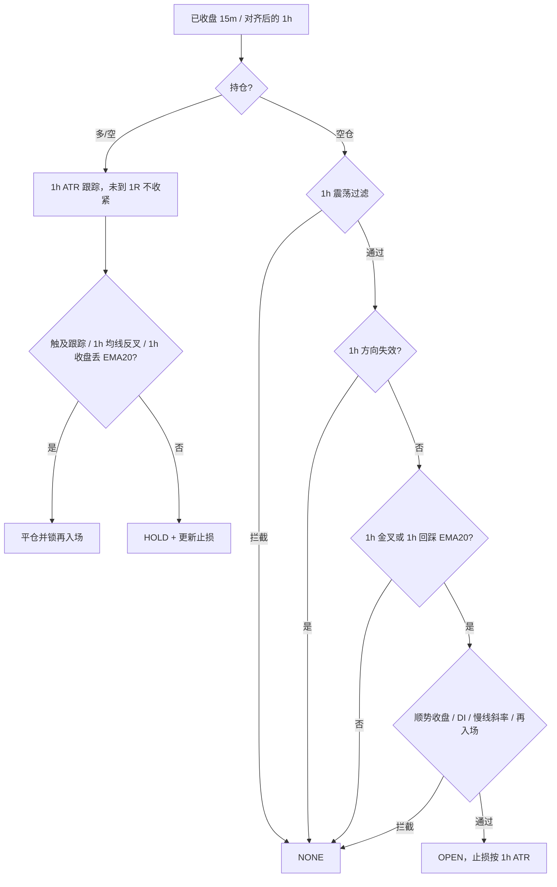

# 策略说明

本文档对应 `backend/internal/strategy` 的实现，以及 `backend/configs/config.yaml` 中当前随仓库发布的参数。引擎每轮把持仓同步进策略，策略只在**已收盘 K 线**上给出一条信号，不重绘。

当前运行：`strategy.name: trend`，标的 ETHUSDT 永续。

| 名称 | 配置值 | 实现 | 用途 |
|------|--------|------|------|
| 趋势回调 | `trend` / `trend_follow` | `TrendFollow` | 1h 定方向，15m 在 1h EMA 附近回调进场，1h ATR 止损与跟踪 |
| 压缩突破 | `squeeze` / `squeeze_breakout` | `SqueezeBreakout` | 主周期 Donchian 突破，只在波动压缩后开仓 |
| 维加斯通道 | `vegas` / `vegas_tunnel` | `VegasTunnel` | 4h 回踩刚形成的 EMA144/169 通道，拿到排列再次交叉 |

共用：`atr_period: 14`，`min_bars: 220`（squeeze 还会按指标预热再抬高下限）。

---

## 引擎怎么用策略

策略接口只有三件事：`Name`、`Sync(持仓)`、`Evaluate(主周期K线, 市场上下文)`。

信号动作：

- `NONE`：观望或持仓（持仓时 `StopLoss` 仍是当前跟踪止损，引擎会去对齐交易所条件单）
- `OPEN_LONG` / `OPEN_SHORT`：开仓，必须带止损
- `CLOSE_LONG` / `CLOSE_SHORT`：全部平掉
- `REDUCE_LONG` / `REDUCE_SHORT`：按 `Portion` 减仓（仅 squeeze 的 TP1）

规则：

1. 最后一根未收盘 K 线会被丢掉，信号只看已收盘 bar。
2. 趋势策略若配置了与主周期不同的 `timeframes.entry`（默认 15m），引擎会把这组 K 线放进 `MarketContext.Entry`。squeeze **不用**入场周期。vegas 也不用，它按自己的 `strategy.vegas.interval`（默认 4h）拉 K 线，不跟 `timeframes.primary`。
3. 持仓状态每轮从纸面账户或币安仓位推入策略；重启后靠 Redis 快照恢复跟踪止损和再入场锁。
4. 策略本身不算仓位数量。数量由风控按「单笔风险 / 止损距离」计算，再受名义价值上限约束。

---

## 趋势策略（TrendFollow）

文件：`backend/internal/strategy/trend.go`。

思路：在已经确认的趋势里，等价格回到快线附近再进，而不是追突破。ADX 只衡量趋势强度、不区分多空，所以方向必须另用均线和 DI 确认。

### 周期分工

| 周期 | 配置 | 职责 |
|------|------|------|
| 主周期 | `timeframes.primary: 1h` | 方向、震荡门、EMA200、DI/斜率、初始止损与跟踪（1h ATR / 1h 摆动点）、趋势翻转 / 收盘丢 EMA20 离场 |
| 入场周期 | `timeframes.entry: 15m` | 只用来对齐 1h 收盘时刻与跟踪；**默认不再用 15m 回踩开仓** |

未配置入场周期（或与主周期相同）时，开仓形态全在主周期上。多周期默认关掉 15m 金叉和 15m 回踩：15m 碰到 EMA20 往往只是 1h 阴线里的噪声，下一根 1h 收盘丢掉均线就会平仓，胜率被打低。开仓改在 **1h 收盘**：回踩 1h EMA20 收回，或 1h EMA20/60 交叉。

### 多空判定（1h）

- 多头：EMA20 > EMA60；若 `use_ema200_filter`，还要 1h 收盘与现价都在 EMA200 上方。
- 空头：对称。
- 仅均线金叉、价格已跌破 EMA200 时，**不会**当多头。

### 开仓

必须先通过 1h 震荡过滤，再出现下面形态之一。

**震荡过滤（`chopBlock`，做在 1h 上）**

| 条件 | 当前 | 拒绝原因（多周期带 `1h ` 前缀） |
|------|------|--------------------------------|
| ADX < `adx_min` | 25 | `ADX … chop` |
| ADX 不高于 `adx_rising_bars` 根之前，且 ADX < `adx_rising_exempt` | 2 / 30 | `ADX falling … chop` |
| \|EMA20−EMA60\| < `ema_sep_min_atr` × 1h ATR | 1.0 | `EMA tangled …` |

均线刚粘上的弱反抽在这里被挡掉。单边行情里 ADX 往往会在趋势中段见顶回落，所以 ADX ≥ 30 时不再要求它继续抬升，否则整段主升/主跌都进不去。

**方向过滤（`directionBlock`）**

- `use_di_filter`：多头要求 +DI > −DI，空头相反。
- 慢线斜率：EMA60 在 `ema_slope_bars`（5）根内的变化，多头至少 `+0.08` × 1h ATR，空头至少同样幅度向下。走平不开。

**方向失效（`require_ema20_side`，默认开）**

EMA20/60 还没交叉时，1h 看起来仍是多头，但新下跌已经开始。此时：

- 开新多：1h **收盘**或**现价**（15m 收盘）任一 ≤ 1h EMA20 → 拒绝（`close lost 1h EMA20` / `price below 1h EMA20`）。
- 开新空：对称。
- 持仓离场：只用 1h **收盘**相对 EMA20，15m 刺破不算，避免被噪声洗出。

**入场形态（必须处于对应 1h 趋势中；默认只认 1h 收盘）**

1. **1h 回踩 EMA20（`allow_htf_pullback` + `htf_pullback_confirm`）**  
   回踩当根只记形态，**下一根 1h 收盘仍站在 EMA20 有利一侧才进**。擦边收回、下一根立刻丢均线的假动作不会开仓。
2. **1h 旗形突破（`allow_htf_flag`，ADX ≥ `continuation_adx`）**  
   突破前 `flag_pause_bars`（3）根 1h 必须缩在更早那根的高/低之内，停顿区间 ≤ `flag_max_range_atr`（1.5）× ATR，收盘打穿停顿端至少 `flag_min_break_atr`，且离 EMA20 不超过 `flag_max_ext_atr`（2.5）× ATR。只看「前一根没创新高」会在震荡里连续假突破。
3. **1h EMA20/60 交叉（`allow_htf_cross`）**  
   趋势起点。
4. **15m 回踩 / 交叉**：默认关。

**其它质量门**

- `require_bar_confirm`：回踩看 **1h K 线** 是否顺势收盘（1h 交叉不要求）。
- `chase_max_atr` 只约束 15m 交叉追价。
- 再入场锁未解除（见下文）。



### 止损与持仓

`use_htf_atr` 默认开启：多周期时止损和跟踪都按 **1h ATR / 近 10 根 1h 摆动点**，不用 15m ATR。15m 波动远小于 1h 噪声，用它做止损会把仓位放大，下一根 1h 阴线就扫出。

初始止损（多）：

```
stop = min(现价 − atr_stop_mult × 1h ATR, 近 10 根 1h 摆动低点)
若距离 < min_stop_atr × 1h ATR：拉宽到该距离（widen_min_stop，默认开）
```

空头对称。当前 `atr_stop_mult: 1.5`，`min_stop_atr: 1.2`。`widen_min_stop: false` 时改回拒绝（`stop too tight`）。

持仓后：

- **未到 `trail_after_r`（1.0R）之前不收紧**，止损停在开仓位，避免 15m 噪声把新单走出。
- 达到 1R 后按 `atr_trail_mult` × 1h ATR（2.0）只向有利方向收。实盘由引擎挂 STOP_MARKET，只收紧不放宽。
- 1h EMA20/60 反叉：`ema cross down` / `ema cross up`。
- 默认 **不会** 因为 1h 收盘丢 EMA20 就平仓。回踩进场就在 EMA20 附近，再用「丢 EMA20」离场等于把止损收成几块钱。`exit_on_ema20_loss: true` 才恢复旧行为。

策略给出 `CLOSE_*` 时引擎市价平仓；交易所条件单先成交时，引擎按仓位消失记账，并在后续从币安成交同步真实 `realizedPnl`。标记价已经穿过止损时，引擎不再挂条件单，改为市价平仓。

### 再入场锁

止损或平仓后，同一方向不能立刻在同一价位再进。锁存在 Redis，重启仍有效。

解锁要同时满足（默认）：

1. `require_reset`：15m 出现一根完全离开 EMA20 的 K 线（多：最低价 > EMA20）。
2. `reentry_htf_reset`：1h 收盘重新站上（多）或跌破（空）EMA20。仅 15m 反弹不够，否则下跌中一次反抽就会把锁打开。
3. `reentry_cooldown`：离场后再等 4 根 **15m** K 线。
4. `reentry_atr`：现价与上次开仓价（或当时 EMA20）距离 ≥ 0.25 × 15m ATR。

### 趋势参数（当前配置）

| 键 | 值 | 作用 |
|----|----|------|
| `ema_fast` / `ema_slow` / `ema_filter` | 20 / 60 / 200 | 趋势栈与 EMA200 过滤 |
| `adx_period` / `adx_min` | 14 / 25 | 强度下限 |
| `adx_rising_bars` / `adx_rising_exempt` | 2 / 30 | 弱趋势要求 ADX 抬升；ADX≥30 免检 |
| `ema_sep_min_atr` | 1.0 | 均线间距，挡弱反抽 |
| `ema_slope_bars` / `ema_slope_min_atr` | 5 / 0.08 | 慢线不能走平 |
| `use_di_filter` | true | +DI / −DI 与方向一致 |
| `cross_adx_bonus` | 5 | 交叉需 ADX ≥ adx_min+5 |
| `allow_ltf_cross` / `allow_ltf_pullback` | false / false | 15m 交叉与 15m 回踩默认关 |
| `allow_htf_cross` / `allow_htf_pullback` | true / true | 1h 交叉与 1h 回踩 |
| `htf_pullback_confirm` | true | 回踩后下一根 1h 确认才进 |
| `htf_pullback_min_atr` | 0.15 | 确认根须离开 EMA20 一点 |
| `allow_htf_flag` | true | 强趋势 1h 停顿再突破 |
| `exit_on_ema20_loss` | false | 持仓不平在 EMA20 擦边 |
| `pullback_htf_max_atr` | 0.8 | 仅当打开 15m 回踩时：弱趋势须靠近 1h EMA |
| `continuation_adx` / `continuation_htf_max_atr` | 28 / 0 | 旗形所需 ADX；0 表示不另限距 1h EMA |
| `flag_pause_bars` / `flag_max_range_atr` | 3 / 1.5 | 旗形停顿长度与最大宽度 |
| `flag_min_break_atr` / `flag_max_ext_atr` | 0.15 / 2.5 | 突破幅度下限、离均线上限 |
| `require_bar_confirm` / `close_confirm_frac` | true / 0.55 | 入场 K 线顺势收盘 |
| `atr_stop_mult` / `atr_trail_mult` | 1.5 / 2.0 | 初始止损与跟踪（按 1h ATR） |
| `use_htf_atr` | true | 止损/跟踪/摆动点用 1h |
| `trail_after_r` | 1.0 | 浮盈未到 1R 不收紧 |
| `chase_max_atr` | 1.5 | 禁止远离 15m EMA20 追价 |
| `min_stop_atr` / `widen_min_stop` | 1.2 / true | 过近则拉宽到 1.2×1h ATR |
| `use_ema200_filter` | true | 价格与 1h 收盘相对 EMA200 |
| `require_ema20_side` | true | 丢失快线则方向失效 |
| `reentry_*` / `require_reset` / `reentry_htf_reset` | 见上 | 止损后再入场 |

省略时默认开启：`require_reset`、`reentry_htf_reset`、`require_ema20_side`、`use_htf_atr`、`widen_min_stop`、`require_bar_confirm`、`allow_htf_cross`、`allow_htf_pullback`、`htf_pullback_confirm`、`allow_htf_flag`。要关掉必须写成 `false`。`allow_ltf_cross`、`allow_ltf_pullback`、`exit_on_ema20_loss` 省略则为关。数值门（ADX 抬升、均线间距、斜率、`min_stop_atr`、`pullback_htf_max_atr`、`trail_after_r`）为 `0` 表示关闭。

---

## 压缩突破（SqueezeBreakout）

文件：`backend/internal/strategy/squeeze.go`。只使用主周期（默认 1h）。

思路：安静区间会在通道外堆积止损，价格打掉后容易走出扩张段。先要求波动处于压缩分位，再做通道穿越；资金费率过高说明该方向已经拥挤，当作假突破过滤。

### 开仓

按顺序：

1. **压缩**：突破 **前一根** 的 ATR%（ATR/收盘）在过去 `atr_lookback`（100）根里的分位 ≤ `atr_pct_max`（0.2）。把突破当根算进去会因为真波幅变大而自我否决。
2. **新鲜穿越**：收盘站上 Donchian 上轨（多）或跌破下轨（空），且 **上一根收盘** 仍在通道内或刚好在沿上。停在通道外不重复触发。
3. **趋势**：`use_trend_filter` 时，多头价格须在 EMA200 上方（空头下方）。
4. **不追**：突破点距通道沿 ≤ `breakout_max_atr` × ATR（1.0）。
5. **资金费率**：`use_funding_filter` 时，多头 funding > `funding_abs_max`（0.05%/8h）拒绝；空头 funding 过负同样拒绝。
6. **再入场锁**。

初始止损：`atr_stop_mult` × ATR（1.2），该距离定义为 1R。

### 持仓

与趋势策略不同，突破仓位管理是不对称的：小胜先兑现一部分，剩余用吊灯跑，走平则砍。

| 动作 | 条件 | 默认 |
|------|------|------|
| 吊灯跟踪 | 多：回看高点 − `chandelier_mult` × ATR；只收紧 | period 22，mult 3.0 |
| 结构失败 | 收盘回到 Donchian 中轨内侧 | — |
| 时间止损 | 持仓 ≥ `time_stop_bars` 且进展 < `time_stop_min_r` | 12 根 / 0.5R |
| TP1 减仓 | 进展 ≥ `tp1_r` 且尚未减过 | 1.0R，平掉 50% |
| 保本 | `breakeven_after_tp1`：减仓后止损不低于成本 | true |

进展 R = 浮动盈亏 / \|开仓价 − 开仓止损\|。没有历史止损时（例如接管旧仓）用当前 `atr_stop_mult × ATR` 代替。

### 再入场

- 复位：价格重新回到通道内（`require_reset`）。
- 冷却：2 根主周期。
- 同水平：现价或通道沿距上次开仓 < 0.25 × ATR。

`use_trend_filter` / `use_funding_filter` 省略时默认开启。

---

## 维加斯通道（VegasTunnel）

文件：`backend/internal/strategy/vegas.go`。只用 `strategy.vegas.interval`（默认 **4h**），不用 15m。

通道是 EMA144 与 EMA169，近端是离价格更近的那一条。EMA12 用来确认动量还在通道的趋势一侧。入场由 `entry_mode` 选择，默认 `pullback`。

### 开仓

两种入场共用这些过滤（多头；空头对称）：

1. **排列**：EMA144 > EMA169，且 EMA169 在 `slope_bars` 内的升幅 ≥ `slope_min_atr` × ATR。
2. **动量**：EMA12 在通道近端之外。ADX ≥ `adx_min`（25；写成 0 则不看 ADX）。
3. **确认 K 线**：收盘离开近端至少 `reclaim_min_atr` × ATR，K 线顺势，收盘落在这根振幅靠趋势一侧至少 `close_confirm_frac`（0.55）的位置，而且离近端不超过 `chase_max_atr` × ATR。上一根已经满足同样条件则不再开。

`entry_mode: pullback`（默认）是已经站在通道外之后的回踩：

- `establish_bars` 根内必须先有收盘站在通道外。从另一侧第一次穿出来不算。
- 当根或上一根的影线碰到近端（允许 `touch_atr` × ATR），回踩收盘没有打穿远端超过 `pierce_max_atr` × ATR。

`entry_mode: breakout` 是从通道另一侧穿出来：

- 上一根收盘还在通道内或另一侧，这一根才收到趋势一侧。
- `establish_bars` 根内要有收盘在通道的另一侧。已经在外面的行情不会被当成突破。

`max_stack_age: 120` 只接排列形成后大约 20 天（4h）里的信号。更晚的多半是单边末端，不再开。

`max_stack_age: 120` 只接排列形成后大约 20 天（4h）里的回踩。更晚的回踩多半是单边末端，不再开。

初始止损取回踩极值与通道远端的更远一侧，再垫 `atr_stop_mult` × ATR；距离短于 `min_stop_atr` × ATR 时拉宽到该距离。

### 持仓

目标是把这段单边拿完，而不是在固定盈亏比上离场。

- 不设固定止盈（`use_tp: false`）。价格回到通道近端只是下一次回踩，默认不平仓。
- **EMA144 穿回 EMA169**（`exit_on_stack_flip`）才视为这段趋势结束。
- 浮盈未到 `trail_after_r`（3R）之前，止损停在开仓位。
- 之后用近 `trail_bars` 根极值减去 `atr_trail_mult` × ATR（8）。倍数故意放宽，正常回撤碰不到，只防通道还没交叉时的急跌。

再入场：先出现一根完全离开通道的 K 线，再过 `reentry_cooldown` 根，并且价格或通道沿离开上次开仓至少 `reentry_atr` × ATR。

### 回测（ETHUSDT 永续 4h，2024-10-15 ~ 2026-10-10，初始 10000 USDT）

同一段行情里，固定 1.5R 止盈是 15 笔、胜率 60%、单笔最大约 +210 USDT。改成「只做趋势前段、拿到通道翻转」之后是 3 笔、1 胜 2 负、盈亏比 2.58、合计约 +247 USDT，最大回撤 2.6%。那笔盈利单约 +405 USDT，跟踪止损几乎没把它提前扫掉。样本只有 3 笔，说明的是出场方式能把单边留住，不是稳定的高胜率。

---

## 共用：再入场锁

文件：`backend/internal/strategy/reentry.go`。

仓位从有到无时上锁（策略平仓或交易所止损都算）。同方向新开仓在复位、冷却、离旧价足够远之前会被拒绝。对侧开仓不受影响。

锁字段随 Redis 持久化：`Armed`、方向、入场价、结构边（EMA20 或通道沿）、上锁 bar 时间、是否已复位。

---

## 仓位与风控（策略之外，但决定成交）

文件：`backend/internal/risk/manager.go`。

开仓数量：

```
qty = (权益 × risk_per_trade) / |入场价 − 止损|
qty = min(qty, 权益 × 杠杆 × max_notional_pct / 价格)
```

当前：单笔风险 0.75% 权益，名义价值不超过权益×杠杆的 70%。止损越近单子越大。趋势策略默认把过近止损 **拉宽** 到 `min_stop_atr` × 1h ATR（`widen_min_stop`），既限制仓位也不把 15m 噪声当止损。设成 `false` 则改回拒绝开仓。

熔断（命中后本进程不再开仓，状态进 Redis）：

- 当日已实现亏损 ≥ `max_daily_loss_r`（2R）。R 按当日首次计算的 `权益 × risk_per_trade`。
- 连续亏损 ≥ `max_consecutive_loss`（3）。连亏跨日保留；日亏每日清零。
- 盈利平仓将连亏清零；减仓只计入日 R，不改变连亏。

实盘交易所止损成交会记入连亏；平仓成交从币安 `userTrades` 同步到 SQLite，收益曲线按 `trades.pnl` 累加。

---

## 信号 `reason` 速查

策略把拒绝/开仓/离场原因写在 `reason` 里，日志和 `signals` 表可直接检索。

**趋势常见**

| reason | 含义 |
|--------|------|
| `warmup` / `waiting closed bar` / `indicator NaN` | 数据不足 |
| `1h ADX … chop` / `1h EMA tangled` / `1h ADX falling` | 1h 震荡 |
| `close lost 1h EMA20` / `price below 1h EMA20` | 方向失效，禁止新多 |
| `too far from EMA20, no chase` | 离 15m EMA20 过远 |
| `not a 1h pullback dist=…` | 弱趋势里离 1h EMA20 太远 |
| `trend extended dist=…` | 强趋势但超过 `continuation_htf_max_atr` |
| `1h EMA cross up/down` | 1h 均线交叉进场 |
| `weak reclaim/reject bar` / `weak reclaim/reject close` | 入场 K 线未顺势收盘 |
| `stop too tight` | 止损过近且 `widen_min_stop: false` |
| `waiting setup reset after exit` / `reentry cooldown` / `same level as last exit` | 再入场锁 |
| `1h pullback to EMA20 reclaim/reject` | 1h 回踩进场 |
| `15m pullback to EMA20 reclaim/reject` | 15m 回踩（需打开 `allow_ltf_pullback`） |
| `15m EMA cross up/down + 1h trend` | 15m 交叉（需打开 `allow_ltf_cross`） |
| `hold long/short` | 持仓，止损已更新 |
| `1h flag breakout/breakdown` | 1h 旗形突破进场 |
| `trail stop hit` / `ema cross down` | 离场 |

**squeeze 常见**

| reason | 含义 |
|--------|------|
| `no squeeze: ATR% rank …` | 波动未压缩 |
| `inside channel` / `outside channel, no fresh cross` | 无新鲜突破 |
| `against EMA200 trend` | 逆大均线 |
| `breakout already extended, no chase` | 突破已走太远 |
| `funding … too crowded` | 资金费率拥挤 |
| `squeeze breakout, ATR% rank …` | 开仓 |
| `TP1 …` / `trail stop … hit` / `closed back inside channel` / `time stop …` | 减仓或离场 |

**vegas 常见**

| reason | 含义 |
|--------|------|
| `tunnel not stacked long/short` | 144/169 没有顺着该方向排列 |
| `EMA12 not above/below tunnel` | 快线还在通道里 |
| `not a pullback: tunnel was not held` | 这是第一次穿出通道，不是回踩 |
| `no pullback to tunnel` / `pullback broke the tunnel` | 没碰到通道，或回踩收盘打穿了 |
| `too far from tunnel, no chase` | 确认根离通道太远 |
| `weak reclaim bar` / `weak reclaim close` | 确认 K 线不顺势 |
| `vegas pullback reclaim/reject` | 回踩开多 / 开空 |
| `vegas tunnel breakout/breakdown` | 从另一侧穿出开多 / 开空 |
| `not a breakout from the other side` / `already outside tunnel` | 不是从另一侧穿出的新鲜突破 |
| `tunnel stack flipped` | 144/169 反向交叉，单边结束 |
| `tp …R` / `trail stop … hit` | 固定止盈（默认关）或宽跟踪打到 |
| `pullback already traded` | 上一根已经是同一脚回踩 |

---

## 代码入口

| 路径 | 内容 |
|------|------|
| `backend/internal/strategy/strategy.go` | 接口、工厂、已收盘 bar |
| `backend/internal/strategy/trend.go` | 趋势回调 |
| `backend/internal/strategy/squeeze.go` | 压缩突破 |
| `backend/internal/strategy/vegas.go` | 维加斯通道 |
| `backend/internal/strategy/reentry.go` | 再入场锁 |
| `backend/internal/config/config.go` | 参数与默认值 |
| `backend/configs/config.yaml` | 当前运行配置 |
| `backend/internal/engine/engine.go` | 拉 K 线、执行、实盘止损 |
| `backend/internal/risk/manager.go` | 仓位与熔断 |

切换策略：改 `strategy.name` 为 `trend`、`squeeze` 或 `vegas`，重启 `cmd/trader`。vegas 使用 `strategy.vegas.interval`，默认 4h。
